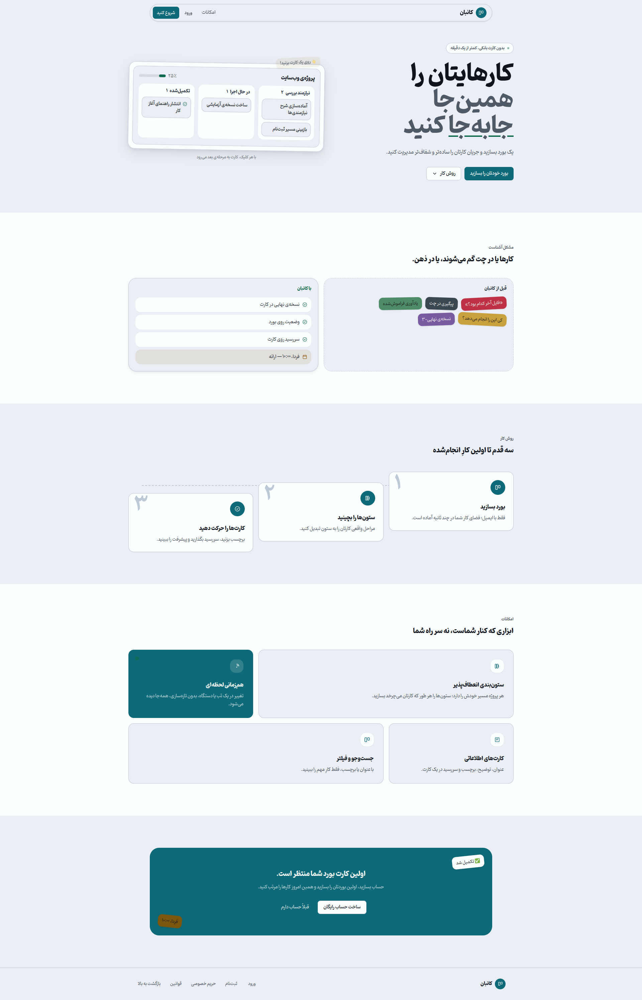

# Kanban App

A real-time collaborative Kanban board with role-based sharing, optimistic updates, and security enforced in the database with Supabase Row Level Security.

**[Live demo](https://kanban-app-nine-red.vercel.app)** · Persian-first (RTL) interface · Light and dark themes



**Built with:** Next.js 16 · React 19 · TypeScript · Tailwind CSS v4 · Supabase (Auth, Postgres, Realtime) · TanStack Query · dnd-kit · Vitest · Playwright


## What it does

- **Boards, columns and cards** with drag-and-drop, including keyboard-accessible card movement
- **Real-time sync** across tabs and users, with automatic resync after a lost connection
- **Board sharing** by email invite with Owner, Editor and Viewer roles
- **Account management**: password reset, data export, and account deletion with password re-check and ownership transfer
- **Accessibility** checked automatically with axe-core, plus privacy policy and terms pages

## Key engineering decisions

**The database is the security boundary.** Row Level Security policies decide who can read or change what. The UI only mirrors those rules, so someone who bypasses the UI and calls the API directly is still blocked. Helper functions that need elevated rights use `SECURITY DEFINER` with an empty `search_path`, and execution is revoked from `anon`.

**Moves update one row.** Cards and columns use fractional positions, and moves go through a database RPC, so a drag changes a single row instead of renumbering a whole column.

**Writes stay in order and conflicts are checked.** A per-board mutation queue keeps writes ordered, optimistic updates make drags feel instant, and a conflict check compares the fields actually being edited before overwriting.

**Realtime is handled by pure, tested functions.** Updates are idempotent (a delete event can arrive twice), and the client refetches after every reconnect because Supabase does not replay events missed during a network drop.

**Two layers of route protection.** `proxy.ts` blocks protected routes on the server before rendering, and a client-side `AuthGuard` handles sessions that expire while the page is open.

## Authorization model

| Capability                                   | Owner | Editor | Viewer |
| -------------------------------------------- | :---: | :----: | :----: |
| View board, columns and cards                |  ✅   |   ✅   |   ✅   |
| Create and edit cards, edit columns, reorder |  ✅   |   ✅   |   ❌   |
| Invite users and manage sharing              |  ✅   |   ❌   |   ❌   |
| Delete the board                             |  ✅   |   ❌   |   ❌   |

## Testing

| Layer                                     | Tooling                                                  | Command                               |
| ----------------------------------------- | -------------------------------------------------------- | ------------------------------------- |
| Unit and component                        | Vitest, Testing Library, axe-core                        | `npm test`                            |
| Types and lint                            | TypeScript, ESLint                                       | `npm run type-check` · `npm run lint` |
| Database                                  | Vitest + PGlite                                          | `npm run test:db`                     |
| Security (RLS, roles, move RPC, realtime) | Node scripts against a real Supabase project             | `npm run test:security`               |
| End-to-end                                | Playwright: auth, CRUD, drag-and-drop, realtime, sharing | `npm run test:e2e`                    |

The security suites run **158 checks against a live Supabase database**, covering ownership isolation, insert policies, cascades, the move RPC, card constraints, realtime, and a full sharing role matrix. Checks that cannot be proven without elevated database access are reported as `UNVERIFIED` instead of being counted as passes; a read-only audit script in `supabase/audit/` covers those.

> The security tests create and delete data, so they refuse to run unless you confirm the target is **not production**. Point `.env.local` at a separate staging project, then run:
> `npm run test:security -- --confirm-non-production`

## Getting started

Requirements: Node.js 20+ and a Supabase project.

```bash
git clone https://github.com/mina-gharzi/kanban-app.git
cd kanban-app
npm install
```

Create `.env.local`:

```
NEXT_PUBLIC_SUPABASE_URL=your_supabase_project_url
NEXT_PUBLIC_SUPABASE_ANON_KEY=your_supabase_anon_key
```

Apply the SQL files in `supabase/migrations/` to your project in order, then:

```bash
npm run dev      # http://localhost:3000
npm run build    # production build
```

## Project structure

```
app/          routes: boards, board, login, register, account, privacy, terms
components/   board, auth, dialogs, legal, ui
hooks/        useBoardRealtime, useCurrentUser, ...
lib/          board logic, queries, supabase clients, error handling
store/        client state (Zustand)
supabase/     migrations and a read-only RLS audit
e2e/          Playwright specs
tests/        security suites
```

## License

MIT © Mina Gharzi
